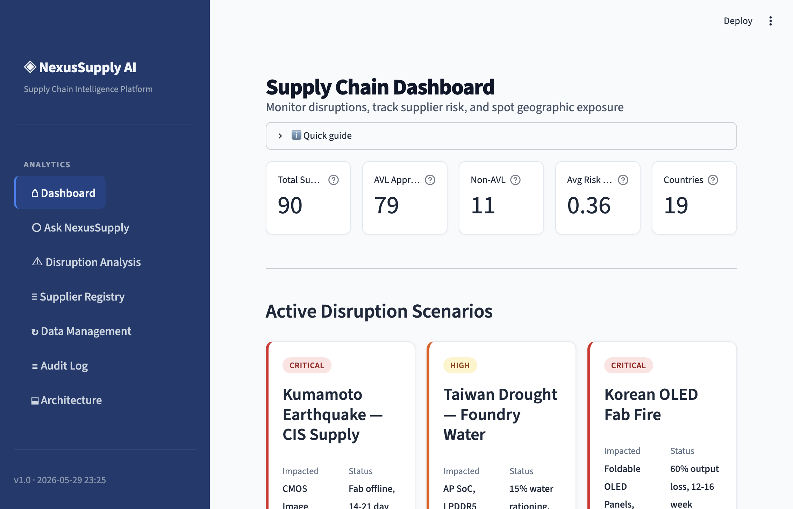
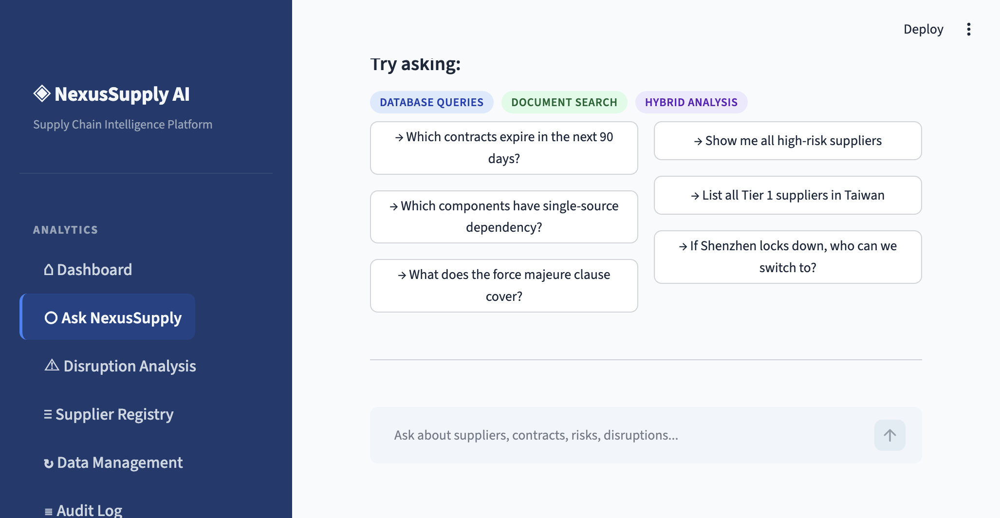
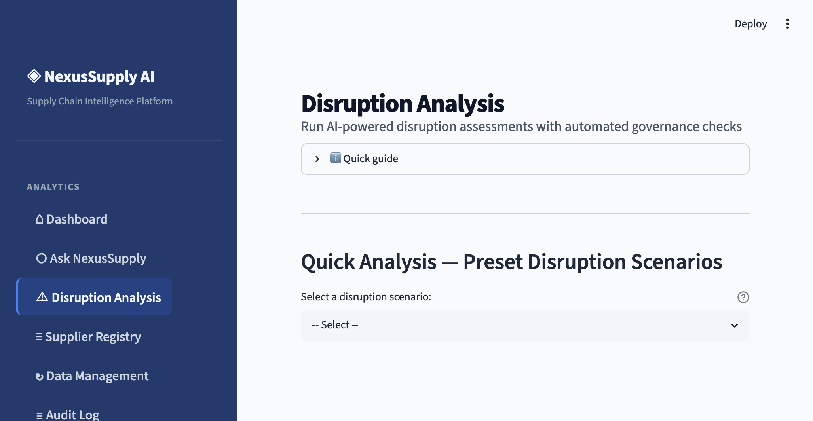
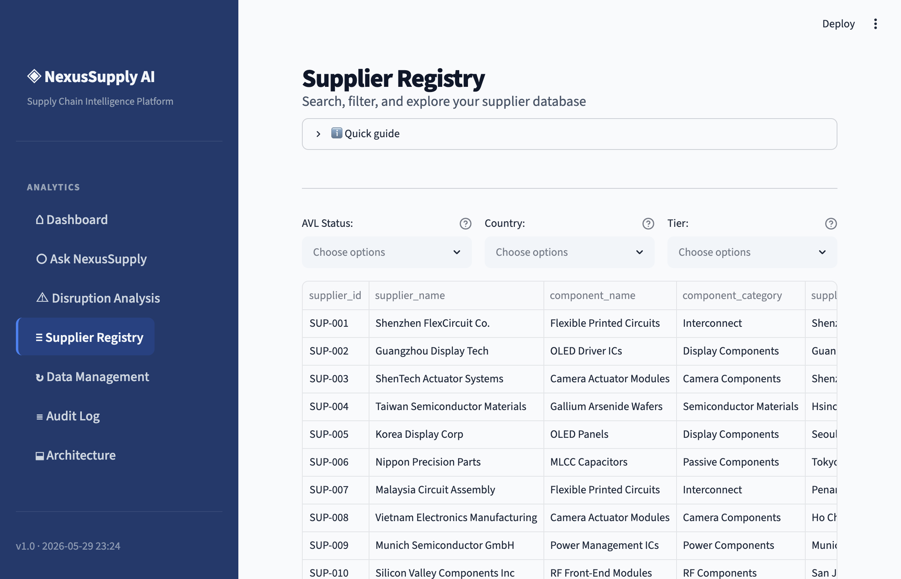
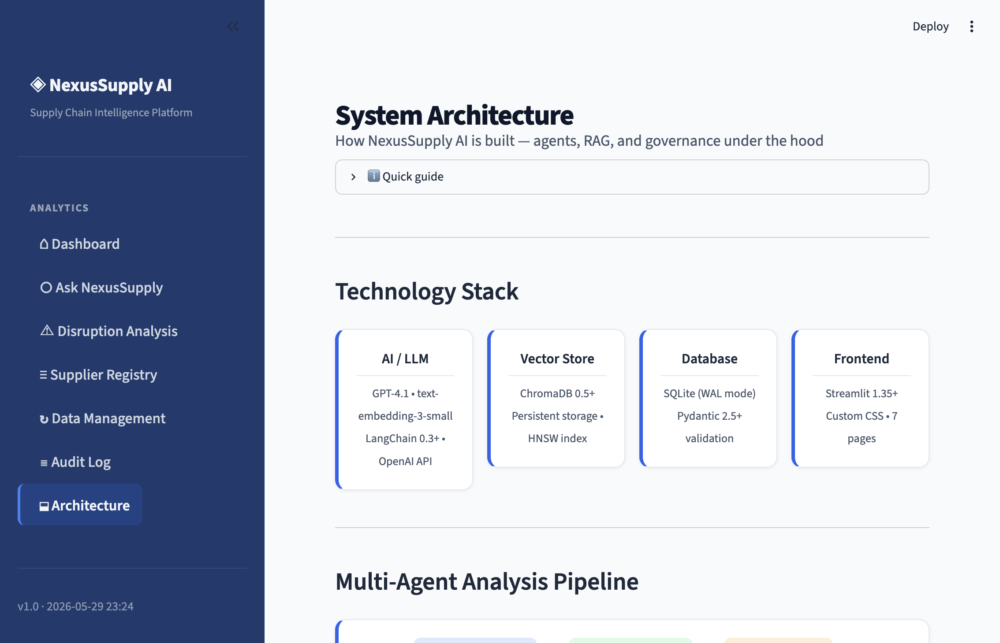

# How I Built a Multi-Agent AI System That Actually Validates Its Own Recommendations (And What Product Managers Can Learn From It)

## This project demonstrates RAG, multi-agent coordination, a governance engine, and explainable AI — all applied to a problem supply chain teams deal with every single day.

---

Everyone is building AI chatbots. Most of them generate text and hope for the best.

I wanted to build something different: an AI system that generates recommendations, checks its own work against hard business rules, and shows you exactly why it made each suggestion — with receipts.

The result is NexusSupply AI, a supply chain disruption intelligence platform. It takes a real-world crisis — say, an earthquake knocking out a critical supplier's factory — and tells a procurement team which suppliers are affected, who they can switch to, and whether those alternatives actually pass compliance. Every recommendation comes with a confidence score, a pass/fail governance verdict, and an evidence trail back to the source documents.

Along the way, this project touches five AI concepts that every product manager will encounter when building or evaluating AI products:

1. **RAG** (Retrieval-Augmented Generation) — how you stop AI from making things up
2. **Multi-Agent Coordination** — why specialized AI agents beat one big prompt
3. **Governance Engines** — how you enforce business rules AI should never decide on its own
4. **Explainable AI** — how you make AI decisions auditable and trustworthy
5. **Semantic Search** — how AI understands meaning, not just keywords

If any of those terms are new to you, don't worry. I'll explain each one as we go.



---

## The Real-World Problem This Solves

Supply chains break. A lot. An earthquake in Japan shuts down a camera sensor factory. A drought in Taiwan slows chip fabrication. A fire at a Korean display plant takes out a single-source supplier for foldable screens.

When these things happen, a product manager at a hardware company needs answers fast:

- **Which suppliers are affected?**
- **Which components are at risk?**
- **Who can we switch to?**
- **Are those alternatives actually approved, contracted, and available?**

Today, most teams answer these questions manually — searching through spreadsheets, emailing procurement contacts, reading through contracts. It takes hours or days. An AI system can do it in seconds — but only if the AI is grounded in real data and its recommendations are validated before a human acts on them.

That's what NexusSupply AI does.

---

## Concept 1: RAG — How You Stop AI From Making Things Up

**The problem:** If you ask GPT-4 "Who can supply CMOS image sensors if our primary supplier goes offline?", it will give you an answer. It might even sound convincing. But it will be completely made up — the model has no idea what suppliers *you* work with, what contracts *you* have, or what components *you* need.

This is called **hallucination**. The AI generates plausible-sounding text that isn't grounded in any real data.

**The solution: RAG — Retrieval-Augmented Generation.**

RAG is a simple but powerful idea: before you ask the AI to generate an answer, you first *retrieve* the relevant documents from your own data, and then you *augment* the AI's prompt with those documents. The AI generates its answer based on your actual data, not its training data.

Think of it like this: instead of asking a consultant to answer your question from memory, you hand them a folder of your company's contracts, supplier records, and incident reports, and *then* ask the question. They're much more likely to give you a useful, accurate answer.

### How RAG Works in NexusSupply AI

The RAG pipeline has two phases:

**Phase 1: Ingestion (one-time setup)**

```
Your data:
├── suppliers.csv          → 90 suppliers, validated, stored in a database
├── contracts/             → 7 supplier contracts
├── policies/              → Procurement policy documents
└── incidents/             → Disruption reports (earthquakes, droughts, etc.)
                               ↓
                    Text is split into small chunks (500 characters each)
                               ↓
                    Each chunk is converted to a "vector" (a list of numbers
                    that captures its meaning — more on this in a moment)
                               ↓
                    Vectors are stored in a vector database (ChromaDB)
```

**Phase 2: Query (every time a user asks a question)**

```
User: "Kumamoto earthquake — what about our camera sensors?"
    ↓
Convert the question into a vector (same way we did with the documents)
    ↓
Search the vector database for the most similar document chunks
    ↓
Retrieve the top 10 relevant chunks (contracts, incidents, policies)
    ↓
Feed those chunks + the question to GPT-4
    ↓
GPT-4 generates an answer grounded in YOUR data
```

**Why this matters for PMs:** If you're evaluating an AI product, ask whether it uses RAG. If the AI answers questions about your company's data but doesn't use RAG (or something like it), those answers are likely hallucinated. RAG is the difference between "AI that sounds smart" and "AI that's actually right."

---

## Concept 2: Semantic Search — How AI Understands Meaning, Not Just Keywords

Traditional search is **keyword-based**. If you search for "camera sensor disruption", it only finds documents that contain those exact words.

**Semantic search** understands meaning. It knows that "CMOS Image Sensor fabrication offline" and "camera sensor disruption" are about the same thing — even though they share almost no words in common. It also knows that "cleanroom contamination at Kumamoto facility" is related, even though it doesn't mention cameras or sensors at all.

### How It Works (Without the Math)

Every piece of text — a sentence, a paragraph, a contract clause — can be converted into a **vector**: a list of hundreds of numbers that represent its meaning in mathematical space. Texts with similar meanings end up close together. Texts with different meanings end up far apart.

When you search, your question is also converted into a vector. Then the system finds document vectors that are closest to your question vector. That's it. No keyword matching. Pure meaning.

**A concrete example from NexusSupply AI:**

The user asks: *"What happens if the Kumamoto factory is hit by an earthquake?"*

Keyword search would miss this contract clause:
> *"In the event of a seismic event at the Kumamoto fabrication facility resulting in production interruption exceeding 14 days, Buyer shall have the right to invoke the Force Majeure clause under Article 6..."*

Semantic search finds it immediately because the *meaning* matches, even though the *words* don't.

### The Similarity Threshold

Not every match is a good match. I set a **similarity threshold of 0.35** — if a document chunk's similarity score is below that, the system throws it out. Without a threshold, the AI gets irrelevant context, which actually makes its answers *worse*.

I tested thresholds from 0.2 to 0.7:
- **Too low (0.2):** The AI drowns in noise — irrelevant chunks dilute the good ones
- **Too high (0.6+):** The system misses documents that use different terminology for the same concept
- **Sweet spot (0.35):** Catches the important stuff, filters out the junk

**Why this matters for PMs:** Semantic search is what makes modern AI products feel "smart." If you're building a product that needs to search through company documents, customer tickets, or knowledge bases, semantic search will dramatically outperform traditional keyword search. But you need to tune the threshold — otherwise you'll either miss important results or flood the AI with irrelevant ones.

---

## Concept 3: Multi-Agent Coordination — Why Specialized Agents Beat One Big Prompt

Here's an approach that doesn't work well: stuffing everything into a single GPT-4 prompt — "Here are 90 suppliers, 7 contracts, 10 policy documents, and 7 incident reports. Now analyze this disruption, find affected suppliers, recommend alternatives, check compliance, and explain your reasoning."

The model will try. It'll produce *something*. But it will be unreliable, hard to debug, and will skip steps when the context gets too long.

**Multi-agent coordination** is a better approach: instead of one agent doing everything, you use multiple specialized agents that each handle one part of the task. An **orchestrator** coordinates them, passing outputs from one agent as inputs to the next.

### The Five Agents in NexusSupply AI

```
User describes a disruption
        ↓
┌─────────────────────┐
│  Orchestrator Agent  │  ← The coordinator — sequences the pipeline
└──────────┬──────────┘
           ↓
┌─────────────────────┐
│  Retrieval Agent     │  ← "What do we know about this disruption?"
│                      │     Searches documents + queries the database
└──────────┬──────────┘
           ↓
┌─────────────────────┐
│  Risk Agent          │  ← "How bad is this? Who's impacted?"
│                      │     Assesses severity and blast radius
└──────────┬──────────┘
           ↓
┌─────────────────────┐
│  Recommendation      │  ← "Who can we switch to?"
│  Agent               │     Suggests alternatives + runs governance checks
└──────────┬──────────┘
           ↓
┌─────────────────────┐
│  Explainability      │  ← "Show your work."
│  Agent               │     Traces every recommendation back to evidence
└─────────────────────┘
```

Each agent has a focused **system prompt** (its instructions) and a focused **context** (only the data it needs). The Retrieval Agent doesn't know about governance rules. The Risk Agent doesn't need to write SQL queries. Each agent does one thing well.

### Why This Architecture Is Better

| Single Agent | Multi-Agent |
|---|---|
| One agent tries everything | Each agent is a specialist |
| When something's wrong, good luck finding where | You can pinpoint exactly which agent produced bad output |
| The context window fills up fast | Each agent works with a focused, manageable context |
| Hard to improve one capability without breaking others | Improve one agent without touching the rest |

**A real example from the codebase:**

Here's how the orchestrator sequences the pipeline — it's straightforward:

```python
def run_analysis(query: DisruptionQuery) -> AnalysisResponse:
    # Step 1: Gather evidence
    retrieval_results = run_retrieval(query)
    
    # Step 2: Assess risk
    risk_analysis = analyze_risk(retrieval_results)
    
    # Step 3: Generate recommendations (with governance checks)
    recommendations = generate_recommendations(retrieval_results, risk_analysis)
    
    # Step 4: Build explainability report
    explainability = build_explainability_report(response)
    
    return AnalysisResponse(...)
```

If the recommendations are bad, you check the Recommendation Agent. If the risk assessment is wrong, you check the Risk Agent. If the wrong documents are being retrieved, you check the Retrieval Agent. Each piece is independently testable and debuggable.

**Why this matters for PMs:** When evaluating AI architectures, ask about agent design. A single monolithic prompt is a red flag for complex workflows. Multi-agent systems are more reliable, easier to debug, and easier to extend. They're also easier to explain to stakeholders — "Agent A does retrieval, Agent B does risk analysis" is much clearer than "the AI figures it out."



---

## Concept 4: Governance Engines — Business Rules AI Should Never Decide

This is the concept I think PMs should pay the most attention to.

AI is great at fuzzy reasoning — analyzing text, spotting patterns, generating summaries. But there are certain decisions that should *never* be left to an AI's judgment:

- Is this supplier on our **Approved Vendor List**?
- Is their contract **still active** (not expired)?
- Does the AI have enough evidence to be **confident** in this recommendation?
- Does the supplier have enough **capacity** to actually fulfill the order?

These are binary, rule-based checks. The answer is yes or no. There's no room for interpretation, and the consequences of getting them wrong are serious — recommending an unapproved supplier could violate compliance policy, and recommending one with an expired contract is worse than useless.

### How It Works in NexusSupply AI

Every recommendation the AI generates passes through **five deterministic checks** before a human sees it:

| Check | What It Validates | What Happens If It Fails |
|-------|------------------|--------------------------|
| **AVL Status** | Is the supplier on the Approved Vendor List? | Blocked — "Non-AVL supplier requires VP Procurement exception approval" |
| **Contract Validity** | Is their contract still active? | Blocked — shows exactly how many days it's been expired |
| **Confidence Score** | Is the AI at least 70% confident? | Blocked — recommendation is too speculative to act on |
| **Capacity Check** | Does the supplier have ≥1,000 units of headroom? | Blocked — "Capacity confirmation required before sourcing" |
| **Allocation Cap** | Is there ≥10% sourcing allocation available? | Blocked — "Below minimum viable threshold" |

Here's the key design decision: **the governance engine is completely separate from the AI.** The AI generates recommendations. The governance engine validates them. The AI is never asked "is this supplier AVL-approved?" — that check is done by deterministic code that queries the database directly.

```python
def validate_supplier_recommendation(supplier: dict) -> list[GovernanceCheckResult]:
    """Run ALL governance checks. No AI involved — pure business logic."""
    return [
        _check_avl_status(supplier),
        _check_contract_validity(supplier),
        _check_moq_feasibility(supplier),
        _check_allocation_cap(supplier),
        _check_headroom_capacity(supplier),
    ]
```

This means governance checks are:
- **Predictable** — same input, same output, every time
- **Auditable** — you can log exactly which check passed or failed and why
- **Trustworthy** — no risk of the AI "reasoning its way around" a compliance rule

Blocked recommendations aren't hidden. They're shown to the user with a clear label — "Blocked: Failed AVL Status Check" — so the user knows the AI considered this supplier but the governance engine flagged it. Transparency builds trust.



**Why this matters for PMs:** Every AI product needs guardrails. If you're building an AI that makes recommendations (hiring, pricing, procurement, anything), separate the AI's creative reasoning from the hard business rules. Let the AI propose. Let deterministic code dispose. This is how you build AI products that legal, compliance, and executive teams will actually approve.

---

## Concept 5: Explainable AI — "Why Did the AI Recommend This?"

If you can't explain *why* an AI made a recommendation, you can't trust it. And in enterprise settings, you definitely can't act on it.

**Explainable AI (XAI)** means the system can trace every output back to the inputs that produced it. Not "the AI thought this was a good idea," but "the AI recommended Supplier X because of evidence found in Contract Y, Section Z, with a similarity score of 0.82."

### Evidence Lineage in NexusSupply AI

The Explainability Agent produces a full audit trail for every recommendation:

```
Recommendation: Switch CIS supply to Sony Semiconductor (SUP-034)
    ↑ based on
Evidence: contract_sup034_sony_cis.txt, Chunk 3, Similarity: 0.84
    Content: "Force Majeure — in the event of seismic activity 
    affecting the Kumamoto prefecture..."
    ↑ grounded in
Governance: ✅ AVL (approved) | ✅ Contract (active, 287 days remaining) 
            | ✅ Confidence (0.88) | ✅ Capacity (45,000 units)
```

Every recommendation includes:
- **Which source documents** supported it (contract name, chunk index)
- **How similar** the source was to the query (similarity score)
- **Which governance checks** it passed or failed
- **Whether it's grounded** — did the AI have enough evidence, or is it speculating?

**Why this matters for PMs:** If you're building AI products for enterprises, explainability isn't optional. Procurement teams need to justify decisions to auditors. Legal teams need to know why a supplier was recommended. Compliance teams need proof that rules were followed. If your AI is a black box, adoption will stall — even if the recommendations are good.

---

## How These Concepts Connect: A Full Query Walkthrough

Let's trace a real scenario through the entire system to see how all five concepts work together.

**The scenario:** *"A magnitude 6.4 earthquake has struck Kumamoto, Japan. The primary CMOS image sensor fabrication facility is offline for 14–21 days."*

**Step 1 — Retrieval Agent (RAG + Semantic Search)**

The Retrieval Agent runs three parallel semantic searches against the vector database:

```
Search 1 (contracts): Finds contract_sup034_sony_cis.txt — 
    the force majeure clause mentioning "seismic event at Kumamoto facility"

Search 2 (incidents): Finds kumamoto_earthquake_cis_supply.txt — 
    the disruption alert with affected supplier IDs and capacity impact

Search 3 (policies): Finds procurement policy on single-source risk
```

Simultaneously, it queries the structured database:
```sql
SELECT * FROM suppliers WHERE country = 'Japan'        -- impacted suppliers
SELECT * FROM suppliers 
    WHERE component_category = 'Camera Components' 
    AND approved_vendor_status = 'AVL'                 -- potential alternates
```

**Step 2 — Risk Agent (Multi-Agent Coordination)**

The Risk Agent receives the retrieval results and assesses severity:
- Sony Semiconductor (SUP-034) is the primary CIS supplier — offline for 14-21 days
- Camera lens and ToF sensor suppliers in the same logistics corridor are at secondary risk
- Severity: CRITICAL — single-source dependency with no immediate backup

**Step 3 — Recommendation Agent (Multi-Agent + Governance)**

The Recommendation Agent proposes alternate suppliers. For each one, the governance engine runs its five checks:

| Supplier | AVL | Contract | Confidence | Capacity | Allocation | Verdict |
|---|---|---|---|---|---|---|
| OmniVision (SUP-035) | ✅ | ✅ | ✅ 0.85 | ✅ 30,000 units | ✅ 0.20 | **Approved** |
| Samsung Electro (SUP-036) | ❌ Non-AVL | — | — | — | — | **Blocked** |

The AI recommended Samsung Electro because it makes CMOS sensors. The governance engine blocked it because it's not on the Approved Vendor List. The user sees both — the approved recommendation *and* the blocked one with the reason.

**Step 4 — Explainability Agent (Explainable AI)**

The final report includes full evidence lineage:
- Which contract clauses were cited
- Which incident reports were relevant
- Similarity scores for each piece of evidence
- A governance summary: 5 checks passed, 1 recommendation blocked

**Result:** The user gets a complete, grounded, validated, explainable analysis — in seconds.

---

## The Conversational Agent: Three Ways to Ask a Question

Not every question needs the full disruption pipeline. The "Ask NexusSupply" chat page uses a **query classifier** — a small AI model that looks at your question and decides the best way to answer it.

**Route 1 — Database Query (structured data)**
> *"Show me all Tier 1 suppliers in Taiwan"*

The classifier recognizes this as a structured data question. It generates a safe SQL query, runs it against the database, and returns formatted results. No AI generation needed — just data retrieval.

Safety note: the system only allows SELECT queries. INSERT, UPDATE, DELETE, and DROP are blocked at the code level to prevent the AI from accidentally modifying data.

**Route 2 — Document Search (semantic search)**
> *"What does the force majeure clause in the Sony CIS contract cover?"*

This triggers a semantic search against the vector store. The system retrieves the most relevant contract chunks and generates an answer grounded in the actual contract text.

**Route 3 — Hybrid (both)**
> *"If the Taiwan foundry has water rationing, who can backfill our AP SoC supply?"*

This needs both: structured supplier data (who makes AP SoCs, who's AVL-approved) AND document context (what does the contract say about force majeure, water curtailment). The system runs both retrieval strategies and combines the results.

A colored badge below each answer shows which route was used — so you always know how the AI arrived at its response.

---

## The Data: Why Realistic Synthetic Data Matters

The system runs on a synthetic dataset that models a realistic smartphone supply chain — 90 suppliers across 19 countries, covering everything from Application Processor SoCs to camera sensors to batteries.

Why synthetic? Because real supply chain data is confidential. But the dataset is realistic enough to demonstrate every capability:

- **Three sourcing tiers** — Tier 1 (strategic), Tier 2 (preferred), Tier 3 (backup)
- **AVL and Non-AVL suppliers** — some approved, some not, so governance checks have something to catch
- **Risk scores from 0.14 to 0.78** — a realistic distribution, not just "all high risk" or "all low risk"
- **Real-world contract clauses** — force majeure provisions for earthquake-prone Kumamoto, water curtailment contingencies for Taiwan drought season, dual-source mandates for foldable OLED

**Six preset disruption scenarios** are ready out of the box — from the Kumamoto earthquake to a Korean OLED fab fire to gallium export restrictions. Each maps to real incident reports in the RAG corpus, so the AI's analysis pulls from actual documents, not generic knowledge.



---

## The Tech Stack (And What Each Piece Does)

| Layer | Technology | What It Does (In Plain English) |
|---|---|---|
| **LLM** | GPT-4.1 | The "brain" — reads documents, reasons about disruptions, generates recommendations |
| **Embeddings** | text-embedding-3-small | Converts text into vectors for semantic search |
| **Orchestration** | LangChain | Manages the flow between agents, tools, and the LLM |
| **Vector Store** | ChromaDB | Stores and searches document vectors locally (no cloud needed) |
| **Database** | SQLite | Stores structured supplier data (names, scores, contracts) |
| **Validation** | Pydantic | Checks every data record at ingestion — rejects bad data before it reaches the AI |
| **Frontend** | Streamlit | The web dashboard — 7 pages, custom CSS, interactive charts |

---

## What I Learned Building This (The Hard Parts)

### 1. Governance Design Is Harder Than AI Design

Writing the AI pipeline took a day. Designing the governance engine — deciding which checks matter, what the thresholds should be, how to display blocked recommendations transparently — took much longer. The easy version is a single "is this supplier AVL?" check. The hard version is: what do you show the user when the AI's best recommendation gets blocked? You can't silently drop it. The user needs to see it was considered AND why it was rejected.

### 2. Retrieval Quality > Model Quality

I spent more time tuning the similarity threshold (0.35) and chunk size (500 characters) than I spent on prompt engineering. A well-tuned RAG pipeline with GPT-3.5 would outperform a poorly-tuned one with GPT-4. The model can only be as good as the context you feed it.

### 3. Validation at Ingestion Prevents Garbage at Query Time

Every supplier record passes through a Pydantic schema at ingestion. If a row has an invalid risk score, a missing contract date, or a malformed supplier ID, it gets quarantined — not silently loaded. This sounds boring, but it prevents a category of bugs that are nearly impossible to diagnose later: "Why did the AI recommend a supplier with a risk score of 1.5?" Because bad data got in.

### 4. Multi-Agent Debugging Is a Superpower

When the system gave a wrong recommendation, I could trace it: was the wrong document retrieved? (Retrieval Agent.) Was the risk assessment off? (Risk Agent.) Was the recommendation itself bad? (Recommendation Agent.) Was a valid recommendation incorrectly blocked? (Governance Engine.) With a single-agent system, I'd be staring at one giant prompt trying to figure out what went wrong.

---

## Running It Yourself

```bash
# Clone
git clone https://github.com/harishbandagari/nexus-supply-ai.git
cd nexus-supply-ai

# Setup
python -m venv .venv && source .venv/bin/activate
pip install -r requirements.txt
echo "OPENAI_API_KEY=sk-your-key-here" > .env

# Launch
streamlit run app.py
```

On first run, go to **Data Management → Run Full Ingestion** to load the supplier database and index documents into the vector store. Then explore the Dashboard, run a disruption scenario, or chat with the AI.



---

## Key Takeaways for Product Managers

If you're building or evaluating AI products, here are the principles from this project that apply everywhere:

1. **RAG is non-negotiable for enterprise AI.** Any AI product that answers questions about your company's data needs retrieval-augmented generation. Without it, you're trusting the model's training data, which knows nothing about your suppliers, contracts, or policies.

2. **Separate AI reasoning from business rules.** Let the AI be creative — generating recommendations, analyzing risk, synthesizing documents. But enforce compliance with deterministic code, not prompts. AI should never be the one deciding if a supplier is AVL-approved.

3. **Multi-agent > monolithic.** For any workflow with more than two steps, specialized agents outperform one big prompt — in accuracy, debuggability, and maintainability. Think of it as microservices for AI.

4. **Explainability drives adoption.** Enterprise teams won't trust a black-box AI. Show the evidence trail. Show which checks passed and failed. Show the confidence score. Transparency converts skeptics into users.

5. **Tune retrieval before tuning prompts.** The quality of your AI's output is bounded by the quality of the context it receives. A perfectly crafted prompt with irrelevant retrieved documents will still produce a bad answer. Get retrieval right first.

6. **Validate data at the gate.** Don't let bad data in and hope the AI handles it. Schema validation at ingestion is the single cheapest investment you can make in output quality.

---

*Built by Harish Bandagari. Connect on [LinkedIn](https://linkedin.com/in/harishbandagari).*

*If you're a PM learning AI and found this useful, share it with your team. The best way to understand these concepts is to see them applied to a real problem.*
